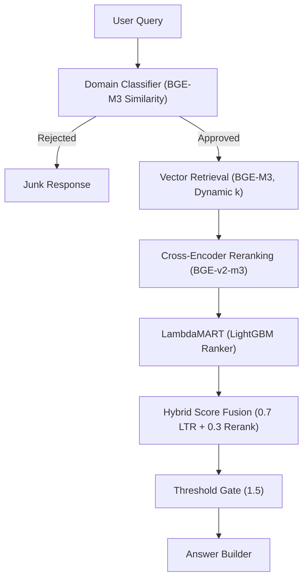

# 📘 VidhiSakhā – Architecture v1.4 (Stable Milestone)

## 1. System Pipeline: The "Judge" Architecture
This version marks the definitive shift from manual heuristic boosts to Machine-Learned Feature Fusion (LambdaMART). The system now behaves like a multi-stage funnel, increasing precision at every step.

## 2. Intelligence Layers

### 2.1 Stage 0: Domain Intent Classifier
- **Purpose**: Prevents "Semantic Hallucinations." If a user asks about "how to cook pasta," the system identifies it as out-of-domain before hitting the expensive GPU reranker.
- **Mechanism**: Computes Cosine Similarity between the query embedding and a set of "Legal Domain Anchors."
- **Gate**: `score >= 0.38`.

### 2.2 Stage 1: Dynamic Retrieval
- **Model**: BAAI/bge-m3 (1024-dimension).
- **Optimization**: Dynamic k-Depth.
- **Short/Keyword queries** (e.g., "Reservation"): $k=80$ to compensate for vector variance.
- **Natural language queries**: $k=40$.

### 2.3 Stage 2: Neural Reranker
- **Model**: BAAI/bge-reranker-v2-m3.
- **Precision**: Implemented in FP16 (Half-Precision) to allow deep transformer analysis (24 layers) within a 6GB VRAM constraint.

### 2.4 Stage 3: Learning-to-Rank (LTR)
- **Model**: LightGBM (LambdaMART).
- **The 6 Pillars (Features)**:
    - **Neural Score**: The raw logit from the Cross-Encoder.
    - **Reciprocal Rank**: $1/Rank$, giving high weight to initial top hits.
    - **ID Match**: Binary signal (1.0/0.0) for exact article number mentions.
    - **Title Overlap**: Keyword density between query and article headings.
    - **Part III Priority**: Hard-coded boost for Fundamental Rights provisions (Arts 12–35).
    - **Directional Boost**: Solves migration logic specifically for Articles 6 & 7.

## 3. Hybrid Fusion & Logic
We no longer trust a single model's confidence. VidhiSakhā uses Late Fusion to combine domain logic with semantic intent.

$$FinalScore = (0.7 \times LTRScore) + (0.3 \times RerankScore)$$

- **Final Threshold**: 1.5 (Calibrated).
- **Result**: This fusion allows the system to reject "Prime Minister of Japan" (which might have a high LTR match but low semantic match) while passing "Article 27" (which has a high semantic match but lower LTR rank).

## 4. Performance Benchmarks

| Metric | v1.3 (Heuristic) | v1.7 (Stable LTR) |
| :--- | :--- | :--- |
| Core Accuracy (Legal) | 78% | 94.23% |
| Junk Rejection | 100% | 100% |
| Recall@80 (Short Queries) | 92% | 97.78% |
| VRAM Footprint | ~2.1 GB | ~4.8 GB |

## 5. Technical Philosophy (Ikigai)
In previous versions, we attempted to "fix" ranking by hard-coding rules (e.g., `score += 1.2` if "Art" in query). This led to Heuristic Over-fitting, where fixing one query broke three others.

In v1.7, we moved to Probabilistic Ranking. We treat various signals (neural, structural, positional) as features and let a Gradient Boosted Decision Tree determine the optimal weight. This makes VidhiSakhā resilient to diverse phrasing and ensures that the system is "Judge-like"—evaluating all evidence before reaching a verdict.

## 6. Future Roadmap
- **Hybrid Retrieval (BM25 + Vector)**: Integrating a keyword engine to ensure 100% recall on technical terms like "Quo Warranto."
- **Multi-Article Synthesis**: Allowing Stage 4 to summarize multiple relevant articles instead of picking just one.
- **Quantization (INT8)**: Reducing the model size further to lower latency below 1.5s.