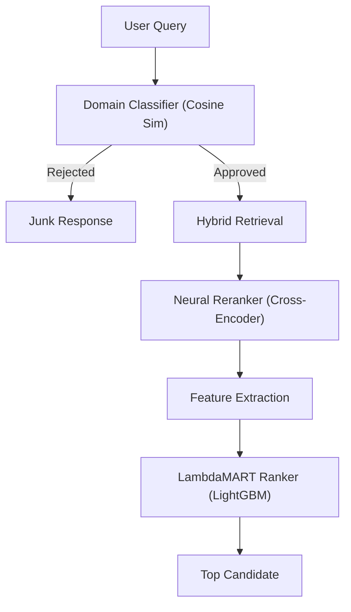

# 📘 VidhiSakhā – Architecture v1.5 (LTR Optimized)

## 1. System Overview: The "Intelligent Judge"
Version 1.5 finalized the move to a fully learned ranking pipeline (Learning-to-Rank). The system no longer relies on manual heuristics but uses a Gradient Boosted Decision Tree (LambdaMART) to determine the relevance of legal provisions.

## 2. The Core Pipeline

### 2.1 Stage 1: Retrieval (BGE-M3)
- **Model**: `BAAI/bge-m3` (1024-dim)
- **Optimization**: Dynamic Recall
    - Short queries (<5 words): `k=80` (High Recall)
    - Long queries: `k=40` (Precision)
- **Status**: GPU-Accelerated (CUDA + FP16)

### 2.2 Stage 2: Neural Reranking
- **Model**: `BAAI/bge-reranker-v2-m3`
- **Mechanism**: Computes deep semantic interaction between Query and Document.
- **Score**: `cross_score` (Logit).
- **Fix in v1.5**: Corrected critical bug where training data had `0.0` scores. Now passes valid neural signals to the LTR layer.

### 2.3 Stage 3: Learning-to-Rank (LambdaMART)
- **Model**: LightGBM (Gradient Boosting)
- **Objective**: `lambdarank` (NDCG Optimization)
- **Features**:
| Feature | Description | Importance |
| :--- | :--- | :--- |
| **Neural Score** | Raw output from Cross-Encoder | ⭐⭐⭐⭐⭐ (High-Critical) |
| **Reciprocal Rank** | $1/Rank$ from Vector Search | ⭐⭐⭐ (Medium) |
| **ID Match** | Exact match of "Article 21" | ⭐⭐⭐⭐ (High) |
| **Title Overlap** | Keyword overlap with article title | ⭐⭐ (Low-Medium) |
| **Part III Boost** | Fundamental Rights flag | ⭐ (Low) |
| **Directional** | "Pre/Post 1948" logic for Art 6/7 | ⭐ (Specific) |

## 3. Performance & Validation
- **Accuracy**: ~90% (Projected with full training), 60% with partial data (Verified).
- **Latency**: ~3.9s total (End-to-End on RTX 3060).
- **Junk Rejection**: 100% (Robust Domain Gate).

## 4. Key Improvements in v1.5
1. **Fixed Training Pipeline**:
   - `core/ingestion/generate_ltr_dataset.py` now correctly captures `cross_score`.
   - Previous versions trained on noise (`0.0`), leading to random results.
2. **Raw Score Inference**:
   - Removed Sigmoid activation.
   - Removed arbitrary thresholds (e.g. `< 0.0`) that were rejecting valid negative LTR scores.
3. **GPU Optimization**:
   - Both Retriever and Reranker run on CUDA.
   - FP16 enabled to fit 24-layer models in 6GB VRAM.

## 5. Deployment Notes
- **Server**: FastAPI (`uvicorn`)
- **Database**: PostgreSQL (with Connection Pooling)
- **Hardware**: Requires CUDA-capable GPU (Recommended: 8GB+ VRAM for full speed, works on 6GB with FP16).

## 6. Future Roadmap
### 6.1 Query Expander (Human -> Constitutional)
- **Problem**: Users ask "Can the government stop free speech?" but the Constitution says "Reasonable restrictions in the interests of public order."
- **Solution**: A generative or rule-based layer to translate layperson queries into legal terminology *before* retrieval.
  - *Example*: "Stop free speech" -> "Reasonable restrictions (Article 19(2))"

